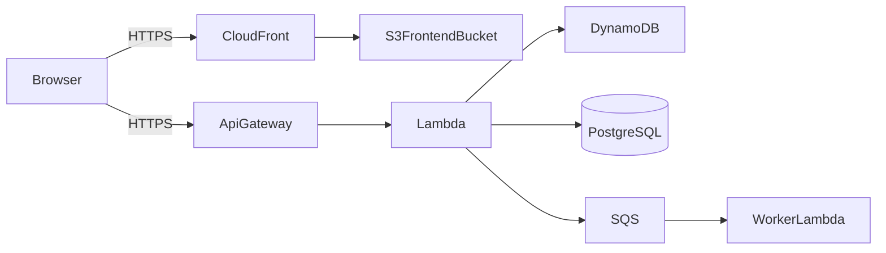

# Documentation Anti-patterns (BSI Portal)

Common mistakes and how to fix them, with examples drawn from this monorepo's stack (TypeScript, React 18, CDK, Lambda).

---

## Tutorial Anti-patterns

### 1. Teaching Concepts Instead of Guiding Action

**Bad** (`docs/tutorials/auth.md`):

```markdown
# Understanding Authentication in BSI Portal

Authentication is the process by which a system verifies a user's identity. BSI Portal uses
OIDC tokens issued by an external identity provider, validated server-side using JWKS…

[3 pages of theory]

Now let's set up auth in your component…
```

**Good:**

````markdown
# Add a Protected Route to the Frontend

In this tutorial, you'll add a route that only authenticated users can access.

## Step 1: Create the Page

Create `apps/frontend/src/pages/Profile.tsx`:

```tsx
export const Profile = () => <h1>Profile</h1>
```
````

## Step 2: Wrap with Auth Guard

```tsx
import { ProtectedRoute } from '@/components/ProtectedRoute'

;<Route
	path="/profile"
	element={
		<ProtectedRoute>
			<Profile />
		</ProtectedRoute>
	}
/>
```

````

**Why:** Tutorials teach by doing. Move OIDC theory to `docs/explanation/auth.md`.

---

### 2. Offering Choices

**Bad:**

```markdown
## Step 3: Pick a State Library

You can use Zustand, Redux Toolkit, or Jotai. Here's how to set up each:

### Option A: Zustand …
### Option B: Redux Toolkit …
### Option C: Jotai …
````

**Good:**

````markdown
## Step 3: Add Zustand State

BSI Portal uses Zustand. Create `apps/frontend/src/stores/counterSlice.ts`:

```ts
import { StateCreator } from 'zustand'

export interface CounterSlice {
	count: number
	increment: () => void
}

export const createCounterSlice: StateCreator<CounterSlice> = (set) => ({
	count: 0,
	increment: () => set((s) => ({ count: s.count + 1 })),
})
```
````

> See [Why we use Zustand](../explanation/why-zustand.md) for the rationale.

````

**Why:** Beginners need one path. The "why" goes in explanation; alternatives go in how-to.

---

### 3. Assuming Prior Project Knowledge

**Bad:**

```markdown
## Prerequisites

- Familiarity with our CDK construct conventions
- Understanding of the BSI environment matrix
- Experience with Middy middleware composition
````

**Good:**

```markdown
## Prerequisites

- Node.js 22+ and pnpm 10.27+ installed
- Repo cloned and `pnpm local:init` completed
- 30 minutes

No prior CDK or Middy experience required — we'll explain as we go and link to deeper docs at the end.
```

**Why:** Tutorials are an entry point. If real prerequisites exist, link to a prerequisite tutorial.

---

## How-to Guide Anti-patterns

### 1. Explaining Concepts Instead of Showing Steps

**Bad:**

```markdown
# How to Deploy the Backend to `dev`

Deployment is the process of synthesizing a CloudFormation template from CDK code and
applying it to an AWS account. BSI Portal uses CDK v2 with TypeScript. The CDK CLI…

[2 paragraphs]

## Steps

1. Run `pnpm cdk deploy`
```

**Good:**

````markdown
# How to Deploy the Backend to `dev`

Ship the latest backend changes to the `dev` environment.

> New to our CDK setup? See [Explanation: CDK architecture](../explanation/cdk.md).

## Prerequisites

- AWS credentials for the `dev` account loaded
- `pnpm setup-env:dev` completed

## Steps

1. Build:
   ```bash
   pnpm build:backend
   ```
````

2. Diff:
   ```bash
   cd apps/backend && pnpm cdk diff
   ```
3. Deploy:
   ```bash
   pnpm cdk deploy --all --require-approval never
   ```

````

**Why:** How-tos are for practitioners. Link to explanation, don't recapitulate it.

---

### 2. Multiple Problems in One Guide

**Bad:**

```markdown
# How to Set Up, Configure, Deploy, and Troubleshoot the Backend
````

**Good:** Split into focused guides:

```markdown
# How to Set Up the Backend Locally

# How to Configure the Backend

# How to Deploy the Backend to `dev`

# How to Troubleshoot Lambda Cold Starts
```

**Why:** Users search for one task. One file = one task.

---

### 3. Bare `console.log` in Backend Examples

**Bad:**

```ts
export const handler = async (event) => {
	console.log('Got event', event)
	// …
}
```

**Good:**

```ts
import { logger } from '@bsi-portal/cdk-tools/lib/client'

export const handler = async (event) => {
	logger.info('Got event', { event })
	// …
}
```

**Why:** Project convention forbids `console.*` in application code. Doc examples set the standard.

---

## Reference Anti-patterns

### 1. Including Instructions

**Bad** (`docs/reference/feature-flags.md`):

```markdown
# Feature Flags Reference

## Adding a Flag

To add a feature flag, first open `apps/backend/lib/feature-flags.ts`, then add a new
entry to the array. Save the file and restart the backend…
```

**Good:**

````markdown
# Feature Flags Reference

## `FeatureFlag` interface

```ts
interface FeatureFlag {
	id: string
	defaultValue: boolean
	envOverrides?: Partial<Record<Environment, boolean>>
}
```
````

## Registry Location

`apps/backend/lib/feature-flags.ts`

## Current Flags

| ID                | Default | Notes |
| ----------------- | ------- | ----- |
| `enableNewSearch` | `false` | …     |

See [How to add a feature flag](../how-to/add-feature-flag.md) for setup.

````

**Why:** Reference describes; how-to instructs.

---

### 2. Inconsistent Format Across Siblings

**Bad** — three reference files, three different layouts:

```markdown
## getUser
returns user. takes id.

---

## `deleteUser(id: string): Promise<void>`
| Param | Type |
|-------|------|
| id    | string |

---

## CreateUser
creates user
````

**Good** — same shape everywhere:

````markdown
## `getUser`

```ts
function getUser(id: string): Promise<User>
```
````

| Param | Type     | Required | Description |
| ----- | -------- | -------- | ----------- |
| `id`  | `string` | Yes      | User ID     |

**Returns:** `Promise<User>`

---

## `deleteUser`

```ts
function deleteUser(id: string): Promise<void>
```

| Param | Type     | Required | Description |
| ----- | -------- | -------- | ----------- |
| `id`  | `string` | Yes      | User ID     |

**Returns:** `Promise<void>`

````

**Why:** Reference docs are scanned, not read. Consistency = scannability.

---

### 3. Hardcoded Secrets in Examples

**Bad:**

```ts
const apiKey = 'sk-prod-xxxxxxxxxxxxxxxx';
````

**Good:**

```ts
const apiKey = process.env.BSI_VENDOR_API_KEY
if (!apiKey) throw new Error('BSI_VENDOR_API_KEY not set')
```

**Why:** Doc examples leak into copy-paste reality. Always model the real secret-handling pattern (env vars + SOPS).

---

## Explanation Anti-patterns

### 1. Being Too Abstract

**Bad:**

```markdown
# Understanding Our Architecture

BSI Portal follows modern architectural principles with a focus on scalability and
maintainability. We leverage industry best practices and a microservices-style approach
to ensure robust performance and reliability.
```

**Good:**

````markdown
# Understanding Our Architecture

BSI Portal is a React SPA talking to a Lambda backend over API Gateway, with state in
DynamoDB and PostgreSQL.


````

We chose Lambda + API Gateway to avoid running EC2 fleets for an internal tool with
spiky traffic. DynamoDB carries hot operational data; Aurora carries reporting data.

````

**Why:** Explanation without concrete artifacts is filler.

---

### 2. Step-by-Step Instructions in Explanation

**Bad** (`docs/explanation/event-driven.md`):

```markdown
# Understanding Event-Driven Architecture

Events let services communicate. Here's how to add one:

1. Add an SQS queue in `apps/backend/lib/queues.ts`
2. Add a handler in `apps/backend/handlers/events`
3. Run `pnpm cdk deploy`
````

**Good:**

```markdown
# Understanding Event-Driven Architecture

Events let services communicate without knowing about each other.

## The Problem with Direct Calls

When the order service calls the notification service directly, it must know the
notification service's address and handle its outages.

## Events as Middleman
```

Order Service ──publish──> SQS Queue ──consume──> Notification Lambda
└──consume──> Audit Lambda

```

Adding a new consumer (audit) doesn't change the producer (order). This decoupling
is why the BSI Portal backend uses SQS for cross-feature communication.

## When We Don't Use Events

For request/response within a single feature (e.g. user submitting a form), we use
direct API Gateway → Lambda calls. Eventual consistency adds complexity, and forms
need synchronous validation.

## See Also

- [How to add an SQS queue](../how-to/add-sqs-queue.md)
- [Reference: queue construct](../reference/queue-construct.md)
```

**Why:** Explanation illuminates. Implementation belongs in tutorial/how-to.

---

## Meta Anti-patterns

### 1. The Everything README

**Bad:** A single 800-line `README.md` containing install, quickstart, full API
reference, architecture rationale, contributing guide, and changelog.

**Good** — README is an index:

````markdown
# BSI Portal

Internal portal for the German Federal Office for Information Security.

## Quick Start

```bash
pnpm local:init
pnpm setup-env:dev
```
````

## Documentation

- [Tutorials](docs/tutorials/) — Learn the basics
- [How-to Guides](docs/how-to/) — Solve specific tasks
- [Reference](docs/reference/) — APIs, configs, error codes
- [Explanation](docs/explanation/) — Architecture and design

## Contributing

See [`AGENTS.md`](AGENTS.md) and [`.github/instructions/constitution.instructions.md`](.github/instructions/constitution.instructions.md).

````

---

### 2. FAQ Posing as Documentation

**Bad** (`docs/FAQ.md`):

```markdown
Q: How do I run the backend locally?
A: Run `pnpm dev:backend`.

Q: What's the format of `cdk.json`?
A: JSON. See …

Q: Why do we use Middy?
A: We evaluated several middleware solutions…
````

**Good:** Split into proper types:

- "How do I run the backend locally?" → `docs/how-to/run-backend-locally.md`
- "What's the format of `cdk.json`?" → `docs/reference/cdk-json.md`
- "Why Middy?" → `docs/explanation/why-middy.md`

FAQs almost always indicate real documentation gaps.

---

### 3. Mixing OpenSpec & Diataxis

**Bad:** Putting an architecture decision narrative in `openspec/changes/<id>/proposal.md`
_and_ trying to use it as the user-facing explanation.

**Good:**

- The proposal stays in `openspec/changes/<id>/proposal.md` (managed by OpenSpec).
- A user-facing explanation lives at `docs/explanation/<topic>.md`, linking back to the
  OpenSpec change for provenance.

**Why:** OpenSpec serves the change/spec workflow; Diataxis serves end-readers. Same
content, different lifecycles and audiences.

---

## Quick Reference

| If you find yourself…                         | You're probably…       | Instead…                                                       |
| --------------------------------------------- | ---------------------- | -------------------------------------------------------------- |
| Explaining concepts in a tutorial             | Mixing types           | Link to explanation                                            |
| Giving choices in a tutorial                  | Confusing beginners    | Pick one path                                                  |
| Writing paragraphs in a how-to                | Teaching               | Be terse, link to explanation                                  |
| Solving multiple tasks in one how-to          | Overloading            | Split into separate guides                                     |
| Writing imperative steps in reference         | Instructing            | Link to how-to                                                 |
| Inconsistent format across reference siblings | Being sloppy           | Adopt the established template                                 |
| Being abstract in explanation                 | Being unhelpful        | Add concrete BSI examples and diagrams                         |
| Writing implementation steps in explanation   | Wrong type             | Link to tutorial / how-to                                      |
| Putting `console.log` in backend examples     | Setting a bad standard | Use `logger` from `@bsi-portal/cdk-tools`                      |
| Inlining secrets in code samples              | Leaking by example     | Use `process.env.X` and link SOPS docs                         |
| Duplicating an OpenSpec proposal as docs      | Mixing workflows       | Keep proposal in `openspec/`, summarize in `docs/explanation/` |
